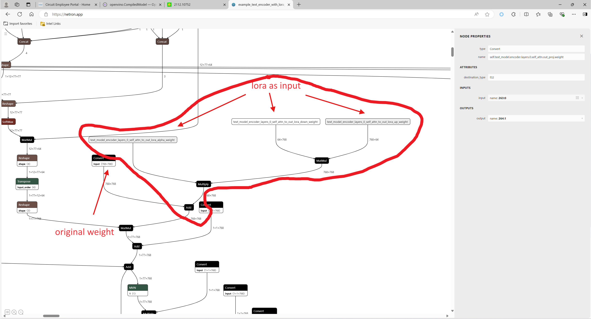

In this part of demo, we try to apply dynamic Lora into stable diffusion 1.5 model without recompile model. Since we do not have related API, such as: modify_weights, add_weights and so on, all lora weights inputs will be treated as Parameter input of whole model. Here is an example for a part of new lora parameter input:


# 1. Performance
see attachment file **performance.xlsx**

# 2. Code 
```python
python ov_model_export.py
```

```python
python ov_model_infer.py
```

